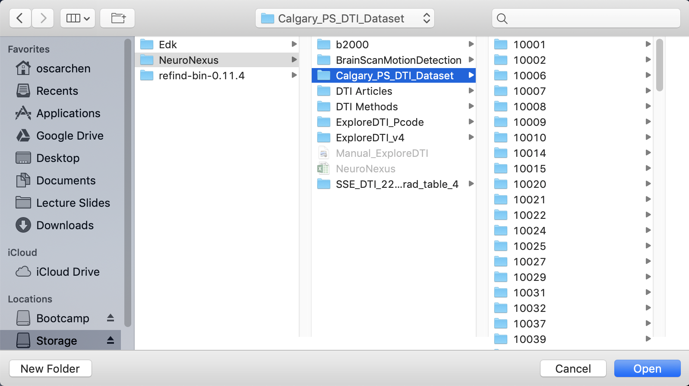
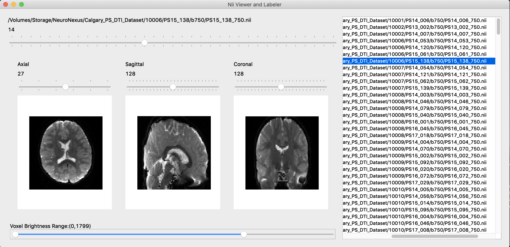

# BrainScanMotionDetection

Open terminal, navigate to Viewer/ and run:
	python Viewers.py

UI will start and ask you to select a folder to load .nii files:

You can select the entire data folder, the program will automatically scan all sub-directories and look for all .nii files.

After finding .nii files, you should see an UI like the following:

- On the right-hand side you will see a list of all the .nii found in the directory you have specified. You can click on any of them to load the file up.
- The large horizontal slider at the top lets you quickly switch between the volumes in a file. 
- The Axial, Sagittal, and Coronal sliders allow you to step through each slice of the volume in the 3 directions.

We are still working on adding training labels to each slice of the volume for machine learning. They will be here soon.

Developers, clone this repo to your NeuroNexus folder:

You will find a playground folder which contains a couple of Jupyter Notebook files for exploring the NiBabel library used to handle the .nii files in Python.